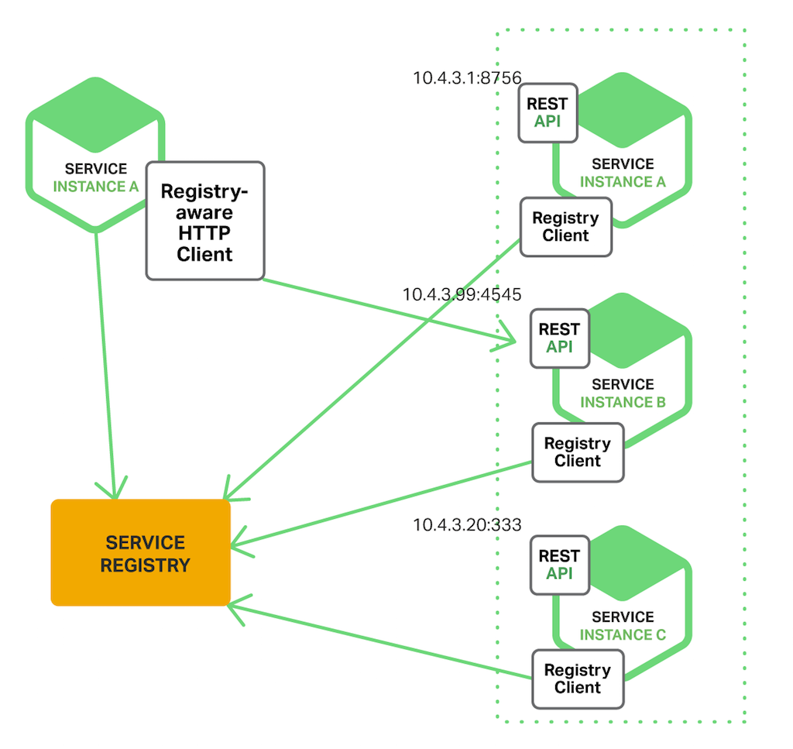

### Microservices起源
2014年,James和Martin合作发表了一篇名为[Microservices](https://martinfowler.com/articles/microservices.html)
的文章,详细探讨了当时正流行起来的一种服务架构模式--microservice,并出以下定义:
>In short, the microservice architectural style is an approach to
 developing a single application as a suite of small services, 
 each running in its own process and communicating with lightweight 
 mechanisms, often an HTTP resource API 
 
经过这几年的发展,微服务已经称为架构模式中最火热的名词之一,很多公司已经在实践了

### 整体式架构(Monolithic Architecture)
传统的Web应用通常分为以下三个部分:
1. 客户端界面: 包含HTML页面和在用户的浏览器运行的JavaScript
2. 服务器: 用于接受客户端请求,执行业务逻辑,与数据库交互,返回合适的HTML到客户端
3. 数据库: 用于持久化数据,通常是关系型数据库

在整体式架构中,服务器部分是一个整体,有以下特点:
1. 一个请求的所有工作都在服务器的单一进程中执行
2. 业务的划分主要通过语言内部的支持:包(package),类(class),方法(function)
3. 只能水平扩展:运行多个服务器,用load-balancer分发请求

整体式架构适合于小型系统,但是当用户数量上升和业务逻辑复杂化了之后,它的缺点也比较明显:
1. 难以部署,任何一个小改动都需要重新部署所有服务器
2. 难以合作开发,没有模块化的概念,代码容易耦合,任何改动都容易影响到其他逻辑
3. 难以扩展,出现性能瓶颈之后只能水平扩展,但是DB的问题无法解决

### 面向服务架构(Service-Oriented Architecture, SOA)
微服务刚兴起的时候,许多人都觉得这只是SOA的另一个名字.SOA概念的形成时间要比Microservices早十年左右,
Martin(还是那个人)在2005年发表过一篇[文章](https://martinfowler.com/bliki/ServiceOrientedAmbiguity.html)
对其进行阐述.
支撑SOA的关键是其消息传输架构--企业服务总线(ESB,Enterprise Service Bus),它是对多样系统中的服务调用者和服务提供者的解耦.
> ESB是传统中间件技术与XML、Web服务等技术相互结合的产物，用于实现企业应用不同消息和信息的准确
  、高效和安全传递.同时它还可以消除不同应用之间的技术差异，让不同的应用服务器协调运作，
  实现了不同服务之间的通信与整合

ESB的基本功能
1. 服务的MetaData管理:在总线范畴内对服务的注册命名及寻址进行管理
2. 传输服务:确保通过企业总线互连的业务流程间的消息的正确交付,还包括基于内容的路由功能
3. 中介:提供位置透明的路由和定位服务,提供多种消息传递形式,支持广泛使用的传输协议
4. 多服务集成方式:如JCA,Web服务,Messaging,Adapter等
5. 服务和事件管理支持:调用服务的记录、测量和监控数据;提供事件检测、触发和分布功能

### 微服务架构(Microservices)
> 定义:一个微服务一般完成某个特定的功能，比如订单管理、客户管理等.每个微服务都是一个微型应用,包括商业逻辑和各种接口.有的微服务通过暴露
  API被别的微服务或者应用客户端所用;有的微服务则通过网页UI实现.在运行时,每个实例通常是一个云虚拟机或者Docker容器。

优点:
1. 通过分解单体应用为多个服务,解决了**复杂度**的问题
2. 每个微服务可由专门的团队来**开发**,相对独立和自由
3. 每个微服务可以独立**部署**,不再需要协调其他服务部署对本服务的影响
4. 每个微服务可以独立**扩展**,可以根据每个服务的规模来部署满足需求的实例

缺点:
1. 微服务应用是分布式系统,开发者需要使用RPC或者消息传递系统来完成**进程间的通讯**
2. 必须使用分布式数据库,由于当前NoSQL数据库和消息中间件不知道分布式事务,不得不使用**最终一致性**
3. 开发测试的时候需要启动多个服务微服务

Scale Cube的3D模型,来自《The Art of Scalability》一书,

#### 使用API网关(API Gateway)构建微服务
使用微服务架构之后,客户端需要与多个微服务进行通讯,如果是客户端与微服务模块间点对点直接通讯,可能会产生以下问题,
1. 客户端需求和每个微服务暴露的细粒度API不匹配
2. 可能有部分服务使用的协议对Web不友好,比如二进制RPC或者AMQP等
3. 使得微服务难以重构,比如服务拆分或者服务组合的场景
为了解决以上问题,需要引入API网关的概念,API网关相当与一个轻量级的**服务总线**

> API网关负责服务请求路由、组合及协议转换。客户端的所有请求都首先经过 API 网关，然后由它将请求路由到合适的微服务。
  API 网关经常会通过调用多个微服务并合并结果来处理一个请求。它可以在 web 协议（如 HTTP 与 WebSocket）与内部
  使用的非 web 友好协议之间转换。

- 优点:封装了服务端的内部结构,客户端只需要与网关交互,而不必调用特定的微服务
- 缺点:需要单独开发和维护这个组件,可能成为开发或运维的瓶颈.使用微服务架构的期望是去中心化和全分布式,但是API会成为
  一个中心点或者瓶颈点

如何实现API网关:
1. 注重性能和可扩展性,将其构建在一个支持异步,IO非阻塞的平台是合理的.
2. 使用响应式编程模型,避免进入回调地狱,使用Scala中的Future、Java 8中的CompletableFuture是明智的选择
3. 服务调用,必须有支持进程间的通信,通常有两个选择:
   - 异步的,基于消息传递的机制
   - HTTP或Thrift那样的同步机制
4. 服务发现,API网关需要知道每个与其通信的微服务的位置,由于微服务的IP和端口是动态分配的,需要一个系统的服务发现机制
5. 处理局部失败,API网关不可能无限期地等待下游服务阻塞,需要根据特定场景处理失败

#### 微服务架构中的进程间通信
> 进程间通信(IPC，Inter-Process Communication)，指至少两个进程或线程间传送数据或信号的一些技术或方法

现在有很多不同的IPC技术,服务间通信可以使用同步的请求/响应模式,比如基于HTTP的REST或者Thrift.
另外,也可以选择异步的、基于消息的通信模式,比如AMQP或者STOMP

##### 基于请求/响应的同步IPC
**REST**: REST基于HTTP协议，其核心概念是资源典型地代表单一业务对象或者一组业务对象，业务对象包括“消费者”或“产品”.
REST使用HTTP协议来控制资源，通过URL实现,常用的框架有RAML和Swagger.使用基于HTTP的协议的有以下优点和缺点:  
- 优点:
  1. HTTP非常简单并且大家都很熟悉
  2. 可以使用浏览器扩展(比如Postman)或者curl之类的命令行来测试API
  3. 内置支持请求/响应模式的通信
  4. HTTP对防火墙友好
  5. 不需要中间代理，简化了系统架构
- 缺点:
  1. 只支持请求/响应模式交互。尽管可以使用 HTTP 通知，但是服务端必须一直发送 HTTP 响应。
  2. 由于客户端和服务端直接通信（没有代理或者缓冲机制），在交互期间必须都保持在线。
  3. 客户端必须知道每个服务实例的 URL。如前篇文章“API 网关”所述，这也是个烦人的问题。客户端必须使用服务实例发现机制。

**Thrift**:
Apache Thrift是一个REST的替代品,实现了多语言RPC客户端和服务端调用.
Thrift提供了一个C风格的IDL(Interactive Data Language)定义API.
通过Thrift编译器能够生成客户端存根和服务端框架.编译器可以生成多种语言的代码,
包括C++、Java、Python、PHP、Ruby、Erlang和Node.js。

##### 基于消息的异步IPC
使用消息模式的时候,进程之间通过异步交换消息消息的方式通信.
客户端通过向服务端发送消息提交请求,如果服务端需要回复,则会发送另一条独立的消息给客户端.
由于异步通信,客户端不会因为等待而阻塞,相反会认为响应不会被立即收到.

当下有大量的开源消息系统可用,如RabbitMQ、Apache Kafka、Apache ActiveMQ等.
宏观上,它们都支持一些消息和渠道格式,并且努力提升可靠性、高性能和可扩展性.然而,细节上它们的消息模型却大相径庭.
使用消息机制有它的优缺点:
优点:
1. 解耦客户端和服务端,客户端不需要一个发现机制来确定服务实例的位置
2. 消息缓冲,只要消息被写入消息中间件,就算有微服务出现宕机无法及时消费,也不会丢失
缺点
1. 额外的操作复杂性,消息系统需要单独安装配置和部署
2. 实现的额外复杂性,开发人员需要额外实现生产者/消费者代码

#### 服务发现的可行方案

##### 客户端发现模式
使用客户端发现模式时,客户端决定相应服务实例的网络位置,并且对请求实现负载均衡.
客户端查询服务注册表,后者是一个可用服务实例的数据库.然后使用负载均衡算法从中选择一个实例,并发出请求.

##### 服务端发现模式

客户端通过负载均衡器向某个服务提出请求,负载均衡器查询服务注册表,并将请求转发到可用的服务实例.
如同客户端发现,服务实例在服务注册表中注册或注销.

AWS Elastic Load Balancer(ELB)是服务端发现路由的例子,ELB通常均衡来自互联网的外部流量,
也可用来负载均衡VPC(Virtual private cloud）)的内部流量.
客户端使用DNS通过ELB发出请求(HTTP或TCP),ELB在已注册的EC2实例或ECS容器之间负载均衡.
这里并没有单独的服务注册表,相反,EC2实例和ECS容器注册在ELB。

HTTP服务器与类似NGINX PLUS和NGINX这样的负载均衡起也能用作服务端的发现均衡器

##### 服务注册表
服务注册表是服务发现的核心部分,是包含服务实例的网络地址的**数据库**,服务注册表需要高可用而且随时更新.
客户端能够缓存从服务注册表中获取的网络地址,然而这些信息最终会过时,客户端也就无法发现服务实例.
因此,服务注册表会包含若干服务端,使用复制协议保持一致性.

##### 服务注册的方式
- 自注册方式:
  服务实例自己负责在服务注册表中注册和注销,如果需要的话,服务实例也要定时发送心跳来保证注册信息不会过时.
  它的优点是相对简单,缺点是把服务实例和服务注册表耦合,必须在每种编程语言和框架内实现注册代码
- 第三方注册模式
  服务实例不需要向服务注册表注册,而是通过**服务注册器**(registrar)来处理.
  服务注册器会通过查询部署环境或订阅事件的方式来跟踪运行实例的更改.
  它的优点是服务和服务注册解耦合,缺点是除非服务注册器内置于部署环境,否则自己需要配置和管理这个组件.

参考资料
1. [基于微服务的软件架构模式](http://www.jianshu.com/p/546ef242b6a3)
2. [ESB和SOA到底是什么](https://zato.io/docs/intro/esb-soa-cn.html#id1)
3. [微服务架构概念解析](http://blog.daocloud.io/microservices-1/)
4. [构建微服务架构：使用 API Gateway](http://blog.daocloud.io/microservices-2/)
5. [微服务架构中的进程间通信](http://blog.daocloud.io/microservices-3/)
6. [服务发现的可行方案以及实践案例](http://blog.daocloud.io/microservices-4/)
7. [什么是微服务](https://www.ibm.com/developerworks/community/blogs/3302cc3b-074e-44da-90b1-5055f1dc0d9c/entry/%E8%A7%A3%E6%9E%90%E5%BE%AE%E6%9C%8D%E5%8A%A1%E6%9E%B6%E6%9E%84_%E4%B8%80_%E4%BB%80%E4%B9%88%E6%98%AF%E5%BE%AE%E6%9C%8D%E5%8A%A1?lang=en)